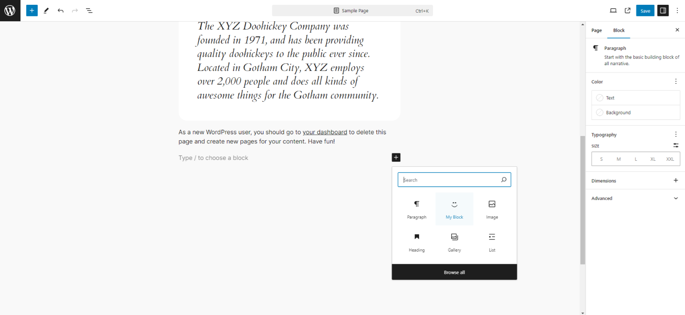

# My Custom Block Plugin

A plugin to add a custom block to the WordPress block editor.

## Description

This plugin demonstrates how to create a custom block for the WordPress block editor (Gutenberg) using React and the WordPress Scripts package.



## Prerequisites

- WordPress installation
- Node.js and npm installed

## Installation

1. Clone this repository or download the zip file and extract it into your WordPress `wp-content/plugins` directory.

2. Navigate to the plugin directory.

   ```bash
   cd wp-content/plugins/my-plugin
   ```

3. Install the necessary npm packages.
    ```bash
    npm install
    ```

4. Build the project.
    ```bash
    npx wp-scripts build
    ```

## Usage
1. Activate the plugin from the WordPress admin dashboard under "Plugins".
2. Go to the WordPress editor (add or edit a post/page).
3. Click the "+" button to add a new block.
4. Search for "My Block" (or the title you gave your block).
5. Add the block to the post/page and verify that it works as expected.

## Development
### Project Structure
```txt
my-plugin/
├── build/
│   ├── index.asset.php
│   └── index.js
├── node_modules/
├── src/
│   └── index.js
├── my-plugin.php
├── package.json
├── package-lock.json
```

## Commands Used
Installing Dependencies
```bash
npm install @wordpress/scripts --save-dev
```
Building the Project
```bash
npx wp-scripts build
```
Clearing npm Cache (if needed)
```bash
npm cache clean --force
```

## License
This project is licensed under the MIT License. See the LICENSE file for details.